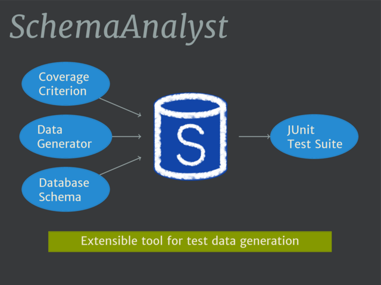

# icsme2016-tool-presentation



This repository contains the LaTeX source code and additional resources for a
presentation that [Cody Kinneer](https://kinneerc.github.io/) (with the advice
and assistance of [Gregory M.
Kapfhammer](http://www.cs.allegheny.edu/sites/gkapfham/) and [Phil
McMinn](http://mcminn.io)) gave at the 32nd IEEE International Conference on
Software Maintenance and Evolution (ICSME 2016). The presentation's source code
uses a wide variety of LaTeX packages, such as `beamer` and `pgftikz`, in order
to create each slide. We have developed a custom theme for the display of the
slides and the use of progressive revealing of technical diagrams.

You are welcome to use these slides as inspiration for your own presentation.
If you find this example useful, could I trouble you to star this repository
and then acknowledge it in your own presentation slides?

You can type the following command if you want to clone this repository:

```shell
git clone https://github.com/schemaanalyst/icsme2016-tool-presentation
```

Then, if you want to compile the presentation to a PDF, you should type the
following commands.

```shell
cd icsme2016-tool-presentation
pdflatex icsme2016_tooldemo.tex
pdflatex icsme2016_tooldemo.tex
```

If this does not work well because you notice that some of the icons are
rendering at a font size that is too small, then please try the following
commands instead.

```shell
cd icsme2016-tool-presentation
xelatex icsme2016_tooldemo.tex
xelatex icsme2016_tooldemo.tex
```

Please note that this has been tested on an Ubuntu 16.04 workstation running a
recent version of LaTeX that was manually installed using the TeXLive
installer.  It is worth noting that you can also compile the paper using other
LaTeX development tools, such as `latexmk` (but note that to ensure certain
icons are not sized correctly you may need to configure `latexmk` to use
`xelatex`). Additionally, you may find that the placement of certain `pgftikz`
diagrams requires manual adjustment depending on your LaTeX development
environment and other settings. If you are unable to compile the presentation
with your development tools and your execution environment, then please open a
new issue and I will attempt to resolve your concerns.
